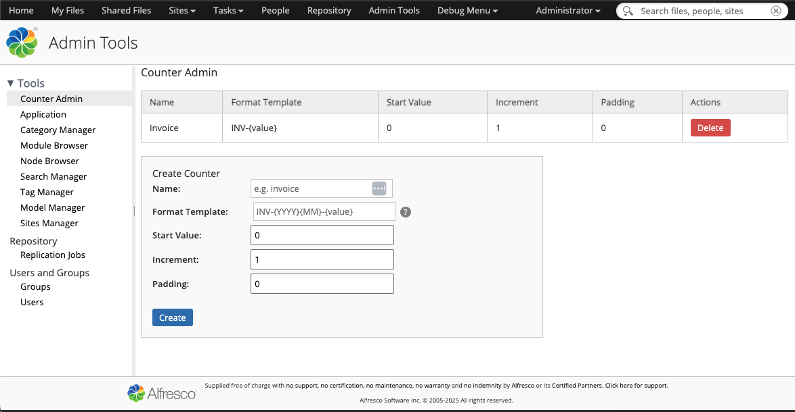
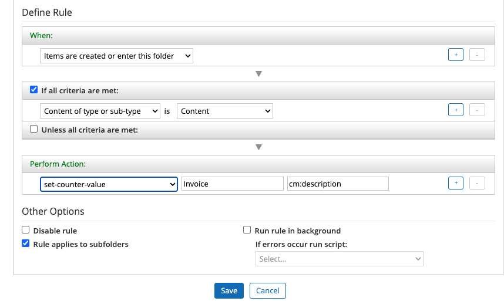

# Alfresco Counter Tool

An Alfresco extension that provides a flexible, cluster-safe auto-increment counter system. Counters can be applied to node properties via a Rule Action. Each counter supports a configurable format template with static text, date tokens, and zero-padding.

Built with Alfresco SDK 4.11.0 targeting Alfresco Community 25.x.

---



## Features

- **Named counters** — create as many independent counters as needed (e.g. `invoice`, `contract`, `po`)
- **Format templates** — combine static text, date tokens, and `{value}` (e.g. `INV-{YYYY}{MM}-{value}`)
- **Zero-padding** — pad the counter value to a fixed width (e.g. `00042`)
- **Cluster-safe** — increments are serialised using Alfresco's `JobLockService`, preventing duplicates across nodes
- **Rule Action** — apply any counter to any node property via a standard Alfresco Rule
- **REST API** — full CRUD for counters at `/alfresco/s/hyland/counters`
- **Share Admin UI** — manage counters from Admin Tools → Counter Admin

### Template tokens

| Token     | Replaced with                              |
|-----------|--------------------------------------------|
| `{value}` | Counter value (zero-padded if padding > 0) |
| `{YYYY}`  | 4-digit year                               |
| `{YY}`    | 2-digit year                               |
| `{MM}`    | 2-digit month (01–12)                      |
| `{DD}`    | 2-digit day (01–31)                        |

**Example:** template `INV-{YYYY}{MM}-{value}` with padding `5` and value `42` → `INV-202605-00042`

---

## Project structure

```text
alfresco-counters/
├── alfresco-counters-platform/          Platform JAR (repo tier)
│   └── src/main/java/com/hyland/alfresco/counters/countertool/
│       ├── model/       CounterModel (QNames), CounterDefinition (POJO)
│       ├── service/     CounterService, CounterServiceImpl, bootstrap component, exceptions
│       ├── action/      SetCounterValueActionExecuter (Rule Action)
│       └── webscript/   5 Java web script handlers (CRUD)
├── alfresco-counters-share/             Share JAR (UI tier)
│   └── .../site-webscripts/com/hyland/countertool/
│       └── counter-admin.get.*          Admin UI Surf web script
├── alfresco-counters-platform-docker/   ACS Docker image
├── alfresco-counters-share-docker/      Share Docker image
├── alfresco-counters-integration-tests/
└── docker/docker-compose.yml
```

---

## Getting started

### Prerequisites

- Docker Desktop
- Java 17+
- Maven 3.3+

### Build and run

```bash
./run.sh build_start
```

This builds both JARs, bakes them into Docker images and starts the full stack (ACS, Share, Search, PostgreSQL). Once up:

| Service        | URL                                                                    |
|----------------|------------------------------------------------------------------------|
| Alfresco Share | <http://localhost:8180/share>                                          |
| Alfresco Repo  | <http://localhost:8080/alfresco>                                       |
| Counter Admin  | <http://localhost:8180/share/page/console/admin-console/counter-admin> |

Default credentials: `admin` / `admin`

### Other run script tasks

| Task                       | Description                                                   |
|----------------------------|---------------------------------------------------------------|
| `build_start`              | Build everything, recreate images, start stack, tail logs     |
| `build_start_it_supported` | As above, plus IT dependencies                                |
| `start`                    | Start stack without rebuilding                                |
| `stop`                     | Stop the stack                                                |
| `purge`                    | Stop and delete all persistent data (volumes)                 |
| `tail`                     | Tail logs of all containers                                   |
| `reload_acs`               | Rebuild platform JAR, recreate ACS image, restart ACS         |
| `reload_share`             | Rebuild Share JAR, recreate Share image, restart Share        |
| `build_test`               | Build, start, run integration tests, stop                     |
| `test`                     | Run integration tests against an already-running stack        |

---

## REST API

All endpoints require admin authentication. Base URL: `/alfresco/s/hyland/counters`

| Method   | Path       | Description          |
|----------|------------|----------------------|
| `GET`    | `/`        | List all counters    |
| `POST`   | `/`        | Create a counter     |
| `GET`    | `/{name}`  | Get a single counter |
| `PUT`    | `/{name}`  | Update a counter     |
| `DELETE` | `/{name}`  | Delete a counter     |

**Create counter — example request:**

```bash
curl -u admin:admin -X POST \
  http://localhost:8080/alfresco/s/hyland/counters \
  -H 'Content-Type: application/json' \
  -d '{"name":"invoice","formatTemplate":"INV-{YYYY}{MM}-{value}","padding":5,"increment":1,"startValue":0}'
```

---

## Rule Action

In Share, create a Rule on a folder:



1. **When:** Items are created and enter this folder
2. **Perform Action:** *Set Counter Value*
3. **Counter Name:** name of the counter (e.g. `invoice`)
4. **Target Property:** QName of the property to write (e.g. `cm:description`)

Every document added to that folder will have the target property set to the next formatted counter value.

---

## Content model

Namespace: `cntr` → `http://www.hyland.com/model/counter/1.0`

Counter nodes are stored in **Company Home → Data Dictionary → Counter Store** and are created automatically on first startup.

---

## Development notes

- The Counter Store folder is created by `CounterBootstrapComponent` on first startup; if the bootstrap has already been marked as run, the service creates the folder lazily on first use
- Cluster safety is ensured by acquiring a `JobLockService` lock per counter name before each increment; the transaction commits before the lock is released
- Hot-reload is supported via JRebel — see `hotswap-agent.properties` in the docker modules
